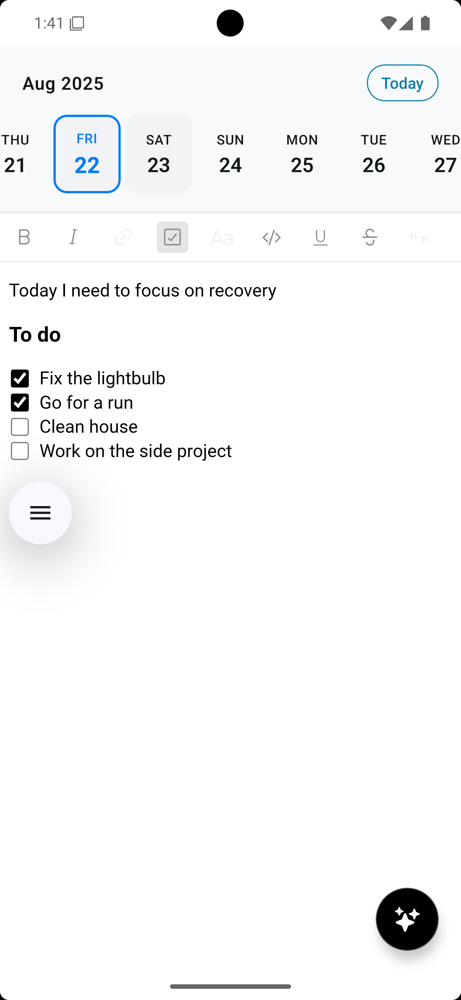

# Pulse 📝

> A sophisticated daily note-taking app built with React Native and Expo, featuring AI-powered chat assistance and intelligent content organization.

<div align="center">

[](https://reactnative.dev/)
[](https://expo.dev/)
[](https://www.typescriptlang.org/)
[](https://openai.com/)
[](https://sqlite.org/)

</div>

## 🎯 Overview

Pulse reimagines daily note-taking by combining a sleek, intuitive interface with powerful AI capabilities. Built for modern productivity workflows, it offers a seamless experience for capturing thoughts, organizing tasks, and gaining insights from your notes through intelligent chat interactions.

## ✨ Key Features

### 📅 **Intelligent Daily Notes**
- **One note per day** approach for focused, organized thinking
- **Infinite horizontal calendar** with smooth scrolling and haptic feedback
- **Visual date indicators** showing edited dates and today's position
- **Auto-save functionality** with debounced content preservation

### 🤖 **AI-Powered Chat Assistant**
- **Context-aware conversations** about your note content
- **Semantic search** through your notes using OpenAI embeddings
- **Task analysis** and productivity insights from your daily entries
- **Smart suggestions** based on your writing patterns

### ✍️ **Rich Text Editing**
- **TenTap editor** with comprehensive formatting options
- **Real-time content sync** with visual save indicators
- **Professional toolbar** with bold, italic, lists, and more
- **Seamless typing experience** optimized for mobile

### 🎨 **Adaptive Design**
- **Automatic light/dark mode** following system preferences
- **Edge-to-edge experience** with proper safe area handling
- **Smooth animations** and transitions throughout
- **Professional UI** with attention to visual hierarchy

## 📱 Screenshots

<div align="center">

### Main Interface & Calendar


*Clean calendar interface with date selection and rich text editor*

### Rich Content Creation


*Rich text editing with formatting tools and task management*

### AI Chat Integration


*Intelligent AI assistant providing insights about your notes*

</div>

## 🏗️ Architecture

### **Core Stack**
- **React Native 0.79.5** - Latest stable cross-platform framework
- **Expo SDK 53** - Modern development toolchain
- **TypeScript** - Full type safety and developer experience
- **SQLite** - Local-first data storage with persistence

### **Key Dependencies**
- **@10play/tentap-editor** - Professional rich text editing
- **OpenAI API** - GPT-powered chat and embeddings
- **date-fns** - Robust date manipulation
- **expo-sqlite** - Local database operations
- **react-native-reanimated** - Smooth animations

### **Modular Architecture**
```
├── app/                    # Main application entry
├── components/            # Reusable UI components
│   ├── calendar/         # Calendar-specific components
│   └── ui/               # Generic UI elements
├── hooks/                # Custom React hooks
├── lib/                  # Database and core utilities
├── services/             # External API integrations
└── types/                # TypeScript type definitions
```

### **Database Schema**
```sql
CREATE TABLE notes (
  id INTEGER PRIMARY KEY AUTOINCREMENT,
  day TEXT UNIQUE NOT NULL,        -- YYYY-MM-DD format
  text TEXT,                       -- Rich text content
  created_at DATETIME DEFAULT CURRENT_TIMESTAMP,
  updated_at DATETIME DEFAULT CURRENT_TIMESTAMP
);

CREATE TABLE embeddings (
  note_id INTEGER PRIMARY KEY,
  embedding BLOB,                  -- OpenAI text embeddings
  created_at DATETIME DEFAULT CURRENT_TIMESTAMP,
  FOREIGN KEY (note_id) REFERENCES notes (id)
);
```

## 🚀 Getting Started

### Prerequisites
- **Node.js 18+** and npm/yarn
- **Expo CLI** (`npm install -g @expo/cli`)
- **OpenAI API key** for AI features

### Installation

1. **Clone the repository**
   ```bash
   git clone https://github.com/yourusername/pulse.git
   cd pulse
   ```

2. **Install dependencies**
   ```bash
   npm install
   ```

3. **Configure environment**
   ```bash
   # Create .env file in project root
   echo "EXPO_PUBLIC_OPENAI_API_KEY=your_openai_api_key_here" > .env
   ```

4. **Start development server**
   ```bash
   npm start
   ```

5. **Run on your platform**
   ```bash
   # iOS Simulator
   npm run ios
   
   # Android Emulator
   npm run android
   
   # Web Browser
   npm run web
   ```

### Development Commands

```bash
# Development
npm start              # Start Expo development server
npm run lint          # Run ESLint code analysis
npm run reset-project # Reset to blank template

# Platform-specific builds
npm run ios           # iOS development
npm run android       # Android development  
npm run web           # Web development
```

## 🎨 Design Philosophy

### **Minimalist Interface**
Pulse embraces a clean, distraction-free design that puts your content first. Every interface element is carefully considered to enhance the writing experience without overwhelming the user.

### **Mobile-First Experience**
Built specifically for mobile interaction patterns with:
- **Gesture-based navigation** through the calendar
- **Haptic feedback** for tactile responses
- **Optimized typography** for readability on small screens
- **Touch-friendly controls** sized for fingers, not cursors

### **Context-Aware AI**
The AI assistant isn't just a chatbot—it understands your notes, remembers your patterns, and provides relevant insights that help you think more clearly about your daily activities and long-term goals.

## 🔧 Technical Highlights

### **Performance Optimizations**
- **Virtualized calendar** for smooth infinite scrolling
- **Debounced auto-save** preventing excessive database writes
- **Memoized components** reducing unnecessary re-renders
- **Background embeddings** processing without UI blocking

### **Data Architecture**
- **Local-first** approach with SQLite storage
- **Semantic embeddings** for intelligent content search
- **Atomic operations** ensuring data consistency
- **Error boundaries** providing graceful failure handling

### **Development Experience**
- **Comprehensive TypeScript** types throughout
- **Custom hooks** for clean separation of concerns
- **ESLint configuration** maintaining code quality
- **Modular component** structure for maintainability

## 📄 License

This project is licensed under the MIT License - see the LICENSE file for details.

---

<div align="center">

**Built with ❤️ using React Native and modern tooling**

*Pulse - Where thoughts become insights*

</div>